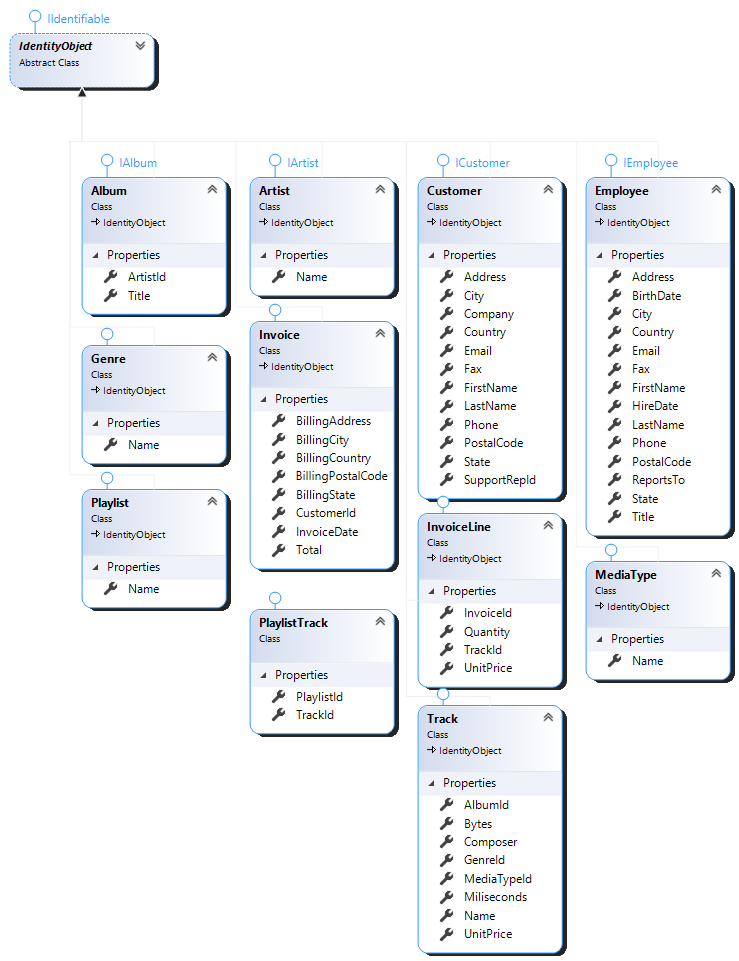
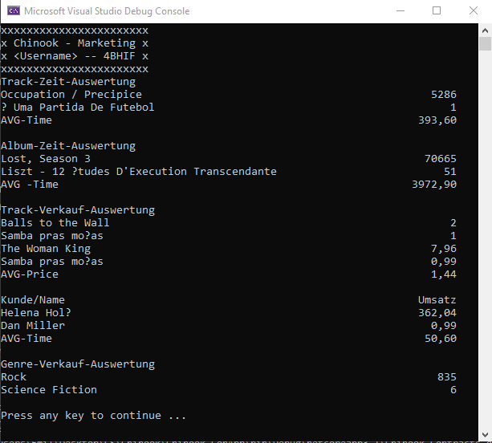

# Chinook

## Anforderungen

Die Marketing Abteilung benötigt für ihre nächsten Aktivitäten folgende Informationenaus den Datenbeständen:

* Track-Zeit-Auswertung
  - Track mit Maximalzeit [sec]
  - Track mit Minimalzeit [sec]
  - Durchschnittszeit [sec]
* Album-Zeit-Auswertung
  - Album mitMaximalzeit [sec]
  - Album mit Minimalzeit [sec]
  - Durchschnittszeit [sec]
* Track-Verkauf-Auswertung
  - Track mit der höchsten Verkaufszahl
  - Track mit der minimalen Verkaufszahl
  - Track mit dem höchsten Umsatz
  - Track mit dem geringsten Umsatz
* Kunden-Auswertung
  - Kunde mit höchsten Umsatz
  - Kunde mit geringstem Umsatz
  - Durchschnittsumsatz
* Genre-Verkauf-Auswertung
  - Genre mit der höchsten Verkaufszahl
  - Genre mit der minimalen Verkaufszahl

## Ausgabe

